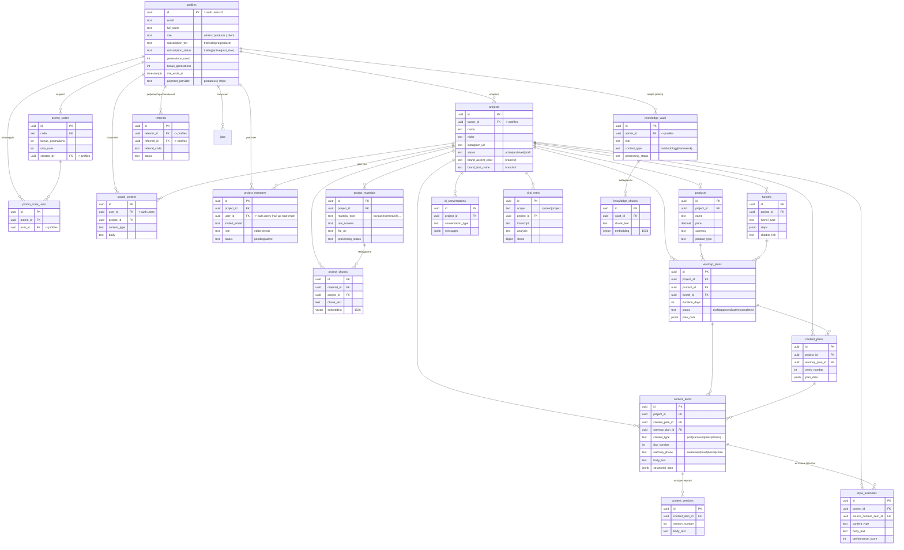

# AMA — ER-диаграмма и таблица сущностей БД (B3)

> Собрано из `supabase/migrations/*` на 13 июля 2026. Источник правды — миграции.
> Для публикации в Google Doc: Mermaid-диаграмму ниже можно вставить через любой Mermaid-рендер
> (mermaid.live → экспорт PNG/SVG), либо через расширение Google Docs с поддержкой Mermaid.
> Таблица сущностей — обычный текст, вставляется как есть.
>
> **Про пользователей:** Supabase Auth хранит юзеров в `auth.users`. Таблица `profiles` расширяет их 1:1
> (`profiles.id = auth.users.id`) и держит роль/тариф/статус подписки. На диаграмме «пользователь» = `profiles`.
> Часть таблиц ссылается напрямую на `auth.users` (помечено в тексте) — по смыслу это тот же пользователь.

---

## ER-диаграмма (Mermaid)

**Сущности без внешних ключей** (стоят отдельно — на диаграмме не связаны): `content_trends` (системные тренды,
`created_by` → auth.users), `billing_events` (идемпотентность вебхуков оплат), `rate_limits` (лимиты запросов
по юзеру, без FK), `error_events` (лог ошибок, `user_id` без FK — логирование не должно падать на битой ссылке).

---

## Таблица сущностей (бизнес-смысл)

| Сущность | Бизнес-смысл | Ключевые связи |
|---|---|---|
| **profiles** | Пользователь системы (расширяет `auth.users`): роль (admin/producer/client), тариф и статус подписки, счётчик генераций, платёжный провайдер | 1:1 с `auth.users`; владеет `projects` |
| **projects** | Проект блогера/эксперта — корень всех данных. Ниша, соцсети, **бренд-кит** (цвета/шрифты для визуального движка) | `owner_id`→profiles; родитель почти всего |
| **products** | Продукт эксперта (курс/наставничество/…): цена, тип, страница продаж. Под продукт строится прогрев | `project_id`→projects |
| **funnels** | Воронка проекта: шаги, тип, ссылка на чат-бот | `project_id`→projects |
| **project_materials** | Загруженные материалы проекта (интервью, кейсы, ToV, исследование аудитории и т.д.) — топливо для RAG | `project_id`→projects |
| **project_chunks** | Векторные эмбеддинги кусков материалов проекта (поиск по смыслу, 1536-мерные) | `material_id`→project_materials, `project_id`→projects |
| **warmup_plans** | План прогрева: длительность, фазы/дни (`plan_data` JSONB), статус. Строится под продукт+воронку | `project_id`,`product_id`,`funnel_id` |
| **content_plans** | Недельный контент-план проекта (`plan_data` JSONB), привязан к прогреву | `project_id`,`warmup_plan_id` |
| **content_items** | Единица контента (пост/карусель/рилз/сторис/…): текст, структура, день, фаза прогрева, метрики. Ядро продукта | `project_id`,`content_plan_id`,`warmup_plan_id` |
| **content_versions** | История версий единицы контента (откат правок) | `content_item_id`→content_items |
| **ai_conversations** | Сохранённые диалоги AI-ассистента по проекту (тип, сообщения, использованный контекст) | `project_id`→projects |
| **style_examples** | Банк эталонов стиля — одобренный контент как образец голоса для генерации; может быть создан из единицы контента | `project_id`, `source_content_item_id` |
| **saved_content** | Библиотека «Готовое» пользователя: сохранённый готовый контент | `user_id`→auth.users, `project_id` |
| **project_members** | Доступы к проекту (командная работа): роль editor/viewer, инвайт по email, статус pending/active | `project_id`, `user_id`, `invited_by` |
| **knowledge_vault** | Системная база знаний (методология/фреймворки/шаблоны), ведёт админ — общая для всех проектов | `admin_id`→profiles |
| **knowledge_chunks** | Векторные эмбеддинги системной базы знаний (RAG по методологии) | `vault_id`→knowledge_vault |
| **content_trends** | Актуальные форматы/тренды контента (системные или по нишам) — подсказки для генерации | `created_by`→auth.users |
| **viral_reels** | Разобранные «залетевшие» рилзы (транскрипт + AI-разбор хука/структуры), системные или по проекту | `project_id`→projects |
| **promo_codes** | Промокоды на бонусные генерации (лимит использований, срок) | `created_by`→profiles |
| **promo_code_uses** | Факт использования промокода (один на юзера на код) | `promo_id`, `user_id` |
| **referrals** | Реферальная программа: кто кого привёл, награда, статус | `referrer_id`, `referred_id`→profiles |
| **billing_events** | Идемпотентность вебхуков оплат (id события провайдера) — чтобы повторный вебхук применился один раз | — (пишет только сервис-роль) |
| **jobs** | Фоновые задачи (расшифровка аудио и т.п.): статус, прогресс, результат | `user_id`, `project_id` |
| **rate_limits** | Счётчики лимитов запросов по юзеру/бакету/окну | — (ключ по user_id) |
| **error_events** | Лог ошибок (сервер/джоба/крон + клиентские ошибки тестеров) — читается в `/admin/errors` | — (`user_id` без FK, best-effort) |

---

## Заметки для вики/Google Doc
- Все дочерние таблицы проекта — `ON DELETE CASCADE` от `projects` (удаление проекта чистит его данные).
- Эмбеддинги (`project_chunks`, `knowledge_chunks`) — `vector(1536)` под OpenAI `text-embedding-3-small`.
- Биллинг-поля живут прямо в `profiles` (тариф/статус/провайдер) — отдельной таблицы «подписки» нет.
- Реальной таблицы «оплаты» (юзер/дата/сумма) пока НЕТ — биллинг спит (`BILLING_ENFORCED`), `billing_events`
  хранит только id вебхуков. Появится при активации Prodamus.
